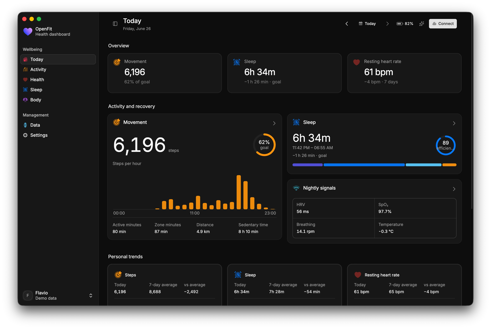

<p align="center">
  
</p>

<h1 align="center">OpenFit</h1>

OpenFit is a private, desktop-first Electron dashboard for Google Fitbit Air and other Fitbit devices, with a built-in AI health assistant. Its adaptive interface prioritizes a small set of useful insights and only displays views, metrics, and navigation when Google Health returns real data.

<p align="center">
  
</p>

> Project status: the application is complete and buildable. Demo mode works without configuration. Accessing personal data requires an OAuth client in your own Google Cloud project. The AI assistant works with Claude or Codex, whichever you already have signed in — no API key required for either.

---

# Part 1 — About OpenFit

## What it is

OpenFit reads your Fitbit/Google Health data locally and presents it as a focused dashboard: Today, Activity, Health, Sleep, Body, and Devices. Everything stays on your computer — credentials, the health cache, and provider preferences are encrypted at rest, and nothing is uploaded to any OpenFit service (there isn't one).

The renderer is built with React 19, shadcn/Radix, Tailwind CSS v4, assistant-ui, Inter Variable, JetBrains Mono, and Nucleo Essential Outline icons, running inside an Electron shell with `contextIsolation`, a strict `Content-Security-Policy`, and no Node integration in the renderer.

## Features

**Dashboard**
- Adaptive views (Today, Activity, Health, Sleep, Body, Devices) that only show sections with real data — no empty cards.
- Steps, calories, distance, floors, active/zone/sedentary minutes, heart rate, HRV, breathing rate, SpO2, skin and core temperature, VO2 max/cardio score, ECG classification, irregular-rhythm alerts, blood glucose, sleep stages and timeline, weight, body fat, hydration, and nutrition — whatever your device and consent actually provide.
- Encrypted per-day local archive so past days load instantly without a new network request.
- Works fully offline in **Demo mode** with no account connected.

**Health providers**
- **Google Health API v4** as the default, recommended provider.
- **Legacy Fitbit Web API** kept as a transitional adapter for accounts not yet migrated (Google is deprecating it in September 2026).
- Both share one normalized data contract, so the UI never branches on which provider is active.

**AI health assistant (dual provider)**
- A chat panel (built with assistant-ui) that answers questions about your own data — trends, comparisons, missing data — and can navigate you to the relevant view.
- Two interchangeable providers, picked from Settings, **Claude selected by default**:
  - **Claude** — runs the Claude Code CLI headlessly (`claude -p`), authenticated with your existing Claude Pro/Max subscription login (`claude login` / `claude setup-token`). No API key is ever read, stored, or billed.
  - **Codex** — reuses Codex Desktop's local `codex app-server`, the same way it always has in OpenFit. No API key here either.
- Both adapters are strictly **read-only**: no tool calls, no shell/file/network access, no ability to modify your health data. Only a compact, credential-free summary of your metrics is ever sent to the model, and only after you send a message.
- If the selected provider isn't available or isn't signed in, OpenFit automatically retries the same question with the other provider (and tells you it did) instead of leaving you stuck.
- Repeated questions about unchanged data are answered from a short-lived local cache instead of spending another turn of your subscription.
- The chat header shows which provider answered, whether it's authenticated, and — for Claude — how many turns/what it cost the last response.

**Privacy & security**
- OAuth tokens, the Client Secret, the health cache, and the assistant provider preference are encrypted with `safeStorage` (Keychain on macOS, Credential Manager on Windows, a secret store on Linux) and never reach the renderer or a log in plain text.
- OAuth happens in the system browser with PKCE; no Google/Fitbit password ever passes through Electron.
- See [Architecture](docs/ARCHITECTURE.md) for the full security model, including a written audit of the codebase (no telemetry, no obfuscated code, no unexpected network destinations).

## How Fitbit data reaches OpenFit

Fitbit Air does **not provide a public Bluetooth synchronization interface** for third-party applications. The supported data path is:

```text
Fitbit Air -> Bluetooth -> Fitbit/Google Health mobile app
                                  |
                                  v cloud sync
                         Google Health API -> OpenFit
```

The desktop application can replace the browsing and analysis experience, but it cannot perform initial device pairing, firmware updates, or phone-to-device synchronization.

---

# Part 2 — Getting started

## Requirements

- Node.js 22 or later
- npm 10 or later
- To use the AI health assistant (optional), sign in to **one** of:
  - [Claude Code](https://docs.claude.com/en/docs/claude-code) — install it and run `claude login` (or `claude setup-token` for a headless machine). Uses your Claude Pro/Max subscription; no API key.
  - [Codex Desktop](https://developer.openai.com/codex) — install it and sign in. OpenFit reuses that local login; no API key.

  Neither is required to run OpenFit itself — without either, the dashboard works normally and the assistant panel just shows as unavailable.

## Quick start

```bash
npm install
npm run dev
```

Useful commands:

```bash
npm run build       # Type-check and bundle the renderer
npm run build:web   # Bundle the hosted web app into dist-web/
npm start           # Serve the web app (static SPA + stateless API)
npm test            # Run normalizer, adapter, and server tests
npm run check       # typecheck + syntax checks + tests + both builds
npm run capture:ui  # Run desktop/mobile visual QA in Electron Chromium
npm run dist        # Package the app for macOS, Windows, or Linux
```

Packages generated locally in `release/` are unsigned unless an Apple Developer ID certificate is available in the Keychain. For public distribution, follow the [release checklist](docs/RELEASE.md).

## Run it as a web app

The same dashboard also runs as a hosted web app, with no database: a small
stateless server handles the OAuth exchange and proxies Google Health reads,
keeping the session in an encrypted cookie. Health data is fetched on demand and
never stored server-side.

```bash
cp .env.example .env          # Google client id/secret + a 32-byte SESSION_SECRET
npm run build:web && npm start
```

To try it without Google credentials:

```bash
MOCK_HEALTH=1 SESSION_SECRET=$(openssl rand -hex 32) npm start
```

The web target supports Google Health only, and does not include the AI
assistant — both assistant adapters drive local CLI binaries, which a browser
cannot do. See [Web deployment](docs/WEB_DEPLOYMENT.md) for setup, security
notes, and known limits.

## Connect Google Health

### Before you begin

You need:

- the Google account used by the Fitbit mobile app;
- access to [Google Cloud Console](https://console.cloud.google.com/);
- Fitbit Air or another supported tracker already paired and synchronized with the Fitbit app;
- OpenFit running with `npm run dev` or as an installed desktop application.

API configuration, OAuth consent, and OAuth credentials must all belong to the same Google Cloud project.

### 1. Create a Google Cloud project

1. Open [Create a Google Cloud project](https://console.cloud.google.com/projectcreate).
2. Name the project `OpenFit`.
3. For a personal account, leave **Organization** set to **No organization**.
4. Create the project and select it from the project picker.

### 2. Enable Google Health API

1. With the OpenFit project selected, open [Google Health API](https://console.cloud.google.com/apis/library/health.googleapis.com).
2. Click **Enable**.
3. Wait until the page shows that the API is enabled or displays **Manage**.

### 3. Configure the OAuth consent screen

1. Open [Google Auth Platform](https://console.cloud.google.com/auth/overview) and click **Get started**.
2. Set the application name to `OpenFit` and enter a support email.
3. Select **External** as the audience. **Internal** only supports accounts in the same Google Workspace organization.
4. Enter a contact email and complete the setup.
5. Open [Audience](https://console.cloud.google.com/auth/audience), add the Google account used by Fitbit as a test user, and save it.

While the application remains in OAuth testing mode, only explicitly listed test users can authorize it. Google normally expires refresh tokens for external applications in testing after seven days; reconnect the account when needed or complete Google's production requirements.

### 4. Add read-only scopes

Open [Google Auth Platform scopes](https://console.cloud.google.com/auth/scopes), choose **Add or remove scopes**, and add these read-only Google Health scopes:

```text
https://www.googleapis.com/auth/googlehealth.activity_and_fitness.readonly
https://www.googleapis.com/auth/googlehealth.health_metrics_and_measurements.readonly
https://www.googleapis.com/auth/googlehealth.ecg.readonly
https://www.googleapis.com/auth/googlehealth.irn.readonly
https://www.googleapis.com/auth/googlehealth.location.readonly
https://www.googleapis.com/auth/googlehealth.nutrition.readonly
https://www.googleapis.com/auth/googlehealth.profile.readonly
https://www.googleapis.com/auth/googlehealth.settings.readonly
https://www.googleapis.com/auth/googlehealth.sleep.readonly
```

Do not add write scopes. OpenFit also requests the standard `openid` and `profile` scopes to display the account name and avatar.

### 5. Create the OAuth client

1. Open [Google Auth Platform clients](https://console.cloud.google.com/auth/clients).
2. Create an OAuth client of type **Web application**.
3. Name it `OpenFit Desktop`.
4. Leave **Authorized JavaScript origins** empty.
5. Add this exact **Authorized redirect URI**:

   ```text
   http://127.0.0.1:42813/oauth/callback
   ```

6. Create the client and retain its Client ID and Client Secret.

Do not commit or share these credentials. During authorization, OpenFit starts a temporary loopback server on port `42813`, validates OAuth `state` and PKCE, receives the authorization code, and then closes the server.

### 6. Connect OpenFit

1. Start OpenFit.
2. Click **Connect Fitbit** and select **Google Health**.
3. Paste the Client ID and Client Secret.
4. Confirm that the callback URL is `http://127.0.0.1:42813/oauth/callback`.
5. Click **Save and connect**.
6. In the system browser, select the same Google account that you added as a test user and approve the requested access.
7. Return to OpenFit. The first synchronization starts automatically.

The connection is working when OpenFit shows **Google Health** instead of **Demo mode**, displays a last synchronization time, and begins showing real device and health metrics. Metric availability depends on the device, region, granted consent, and recent Fitbit mobile synchronization.

### Security note

The Client Secret, OAuth tokens, and health cache stay in Electron's main process and are encrypted with `safeStorage` using Keychain on macOS, Credential Manager on Windows, or an available secret store on Linux. They are not exposed to the renderer or written to the repository.

A Client Secret distributed in a desktop binary is not a durable global secret. The current setup is appropriate for personal use and development. A public release should move the OAuth code exchange to a small backend and complete Google's verification and security-review requirements.

### Troubleshooting

`redirect_uri_mismatch`

- Register `http://127.0.0.1:42813/oauth/callback` exactly. Do not use `localhost`, omit the path, or add a trailing slash.

`Access blocked`, `access_denied`, or unauthorized user

- Confirm that the OAuth audience is **External**.
- Add the correct account under **Audience -> Test users**.
- Sign in with the same account used by the Fitbit app.

`invalid_client`

- Copy the Client ID and Client Secret again from the same OAuth client.
- Remove accidental leading or trailing spaces.
- Do not mix credentials from different Cloud projects.

HTTP 403 or API not enabled

- Confirm that Google Health API is enabled in the same project as the OAuth client.

Port `42813` is already in use

- Close other OpenFit processes and retry. Only one OAuth flow can use the callback port at a time.

Some metrics are missing

- Open the Fitbit app on the phone and wait for the tracker to synchronize.
- Return to OpenFit and click **Sync**.
- ECG, SpO2, skin temperature, HRV, and irregular-rhythm notifications may not be available for every device, account, or country. OpenFit hides sections for which no data exists.

For a longer checklist, see [Google Health setup](docs/GOOGLE_HEALTH_SETUP.md).

## Connect an AI assistant

The chat button in the top bar opens a right-side panel built with assistant-ui primitives. OpenFit talks to whichever provider is selected in **Settings → AI assistant**; both are optional and neither is required to use the rest of the dashboard.

### Claude (default)

1. Install the [Claude Code CLI](https://docs.claude.com/en/docs/claude-code).
2. Run `claude login` in a terminal (or `claude setup-token` if you're on a headless machine) and finish the sign-in with your Claude Pro/Max subscription.
3. In OpenFit, open **Settings → AI assistant** and make sure **Claude** is selected — it's the default.

OpenFit shells out to `claude -p` in headless mode with a hardcoded read-only policy (`--permission-mode default`, a full `--disallowed-tools` denylist, never `--dangerously-skip-permissions`) and strips any `ANTHROPIC_API_KEY`/`ANTHROPIC_AUTH_TOKEN` from the process environment, so it can only use your subscription session — it will never bill a pay-per-token API key.

### Codex

1. Install [Codex Desktop](https://developer.openai.com/codex) and sign in.
2. In OpenFit, open **Settings → AI assistant** and select **Codex**.

OpenFit starts `codex app-server` over stdio and reuses that local session, the same way it always has.

### What the assistant can and can't do

When you send a message, OpenFit creates a compact context containing normalized metrics, available dates, and details for the selected day. It does not include OAuth credentials or encrypted files, and it is sent only after you send a message. The assistant can navigate you to an OpenFit view or date, but it cannot modify health data, run commands, read/write files, or call any tool — this is enforced identically for both providers, not just requested via a prompt.

If your selected provider isn't installed or isn't signed in, OpenFit automatically tries the other one for that question and tells you it did, instead of leaving the chat stuck. No model name is hard-coded for either provider: each uses its CLI's configured default unless a model is supplied programmatically through the service options.

## Project structure

```text
electron/
  main.cjs                    Electron shell, OAuth loopback, IPC, encrypted storage
  preload.cjs                 Minimal typed IPC bridge
  assistant-provider.cjs      Shared AssistantProvider contract, denylist, instructions
  assistant-manager.cjs       Provider selection, fallback, response cache, usage log
  claude-service.cjs          Read-only Claude Code CLI adapter (subscription auth)
  codex-service.cjs           Read-only Codex app-server JSONL client
  text-sanitize.cjs           Shared redaction for error/log text
  google-health-service.cjs   Google Health API v4 provider
  fitbit-legacy-service.cjs   Legacy Fitbit Web API provider with PKCE
server/
  index.mjs                   Web app: static hosting, routing, CSP (Node builtins only)
  config.mjs                  Environment validation, session key
  session.mjs                 AES-256-GCM cookie sealing
  routes/auth.mjs             OAuth start, callback, status, disconnect
  routes/sync.mjs             Authenticated sync proxy
  health-sync.mjs             Sync quality gate ported from main.cjs
  mock-provider.mjs           Generated data for credential-free local runs
src/
  components/                 Views, charts, and assistant-ui chat
  data/                       Demo data and provider-independent normalization
  lib/                        Formatting, pure utilities, and the data bridge
  App.tsx                     UI, connection-state, and Settings orchestration
  types.ts                    Shared renderer/preload contracts
scripts/
  capture-ui.cjs              Electron visual smoke test
docs/
  ARCHITECTURE.md             System decisions, security boundaries, audit notes
  DATA_COVERAGE.md            Data coverage and limitations
  GOOGLE_HEALTH_SETUP.md      Extended OAuth setup guide
  WEB_DEPLOYMENT.md           Hosting the web app: BFF, cookies, limits
  RELEASE.md                  Signing, notarization, and release process
```

See [Architecture](docs/ARCHITECTURE.md) for security boundaries and design decisions.

## Interface principles

- one primary metric per screen, with secondary details ordered by importance;
- no empty cards: unavailable sections remain hidden;
- one accent color for status, progress, and actions;
- aggregated intraday samples for responsive charts without changing minimum, maximum, or latest values;
- accessible shadcn/Radix components and responsive layouts without horizontal overflow.

## Official references

- [Claude Code documentation](https://docs.claude.com/en/docs/claude-code)
- [Google Health API: Cloud and OAuth setup](https://developers.google.com/health/setup)
- [Google Health API: scopes](https://developers.google.com/health/scopes)
- [Google Health API: migration from Fitbit Web API](https://developers.google.com/health/migration)
- [Google Health API: data types](https://developers.google.com/health/data-types)
- [Google Health API: endpoints](https://developers.google.com/health/endpoints)
- [Google OAuth for web-server applications](https://developers.google.com/identity/protocols/oauth2/web-server)
- [Google OAuth for installed applications](https://developers.google.com/identity/protocols/oauth2/native-app)
- [Fitbit OAuth 2.0 with PKCE](https://dev.fitbit.com/build/reference/web-api/developer-guide/authorization/)

Icons: Nucleo Essential Outline (c) Nucleo, used under the [Nucleo license](https://nucleoapp.com/license/).

The information displayed by OpenFit is not a diagnosis or medical advice.
