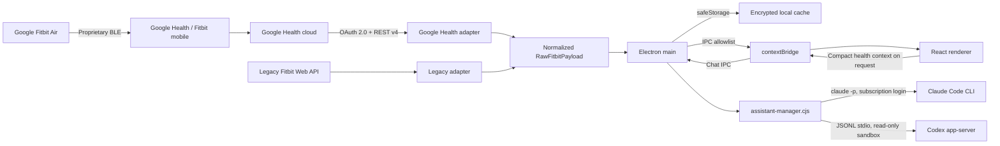

# Architecture

## Goals

- Fast desktop UI that remains useful without an account through demo data.
- Google Health API v4 as the primary provider, with the legacy Fitbit Web API isolated as a fallback.
- No tokens or secrets in the renderer.
- Partial consent and missing sensors must not block the dashboard.
- Encrypted per-day health archive and no upload to OpenFit services. Completed days are read locally without new provider requests. If `safeStorage` is unavailable, or Linux selects the unencrypted `basic_text` backend, saving fails explicitly.
- One normalization layer, so views do not depend on remote API shapes.
- Optional chat through a pluggable AI assistant layer (Claude Code CLI or Codex app-server). The project contains no API key for either provider, and no health data is sent until the user sends a message.

## Flow



## Web Target

The same renderer also ships as a hosted SPA backed by a stateless BFF in
`server/` (see `WEB_DEPLOYMENT.md`). `src/lib/bridge.ts` picks the backend at
startup: `window.fitbit` from the preload under Electron, or an HTTP-backed
implementation of the same `FitbitBridge` contract in the browser. Every view,
`normalizeFitbitData`, and the whole `src/lib` layer are shared unchanged.

The web target drops what cannot exist in a browser: the Fitbit legacy provider,
and the AI assistant (both adapters spawn local CLI binaries, so
`vite.config.ts` aliases the component to a stub in `--mode web` and
`@assistant-ui/react` never enters the bundle).

Persistence differs by design. The desktop app keeps an encrypted per-day
archive on disk; the web app keeps **nothing** server-side — a sealed cookie
holds only the Google refresh token, and health payloads live in the requesting
tab's `sessionStorage`. `server/` reuses `electron/google-health-service.cjs`
verbatim and re-implements the parts of `main.cjs` that are Electron-coupled
(the OAuth callback, token refresh, and the sync quality gate).

## Security Boundaries

### Main Process

The main process is the only process allowed to:

- open the OAuth loopback server;
- know the Client Secret, access token, and refresh token;
- call `health.googleapis.com` and `api.fitbit.com`;
- read and write cache, credentials, and the assistant provider preference;
- open external URLs and export files only after explicit user action;
- start the active assistant provider (Claude or Codex) and forward only the compact health context prepared for the turn.

### Preload

The preload exposes an operation allowlist through `contextBridge`. It does not expose Node, the filesystem, generic `ipcRenderer`, or tokens. Chat events are limited to status, provider list, provider switching, usage log, text deltas, completion, errors, and cancellation — never raw provider output or credentials.

### Renderer

The renderer runs with `nodeIntegration: false`, `contextIsolation: true`, and sandboxing enabled. It receives public status and credential-free health payloads, then normalizes and compacts only the metrics needed before an assistant turn. It never knows which provider is active beyond the label shown in the UI — `HealthAssistant.tsx` and `AssistantProviderSettings` consume the same `HealthAssistantBridge` regardless of whether Claude or Codex answers.

## AI Assistant Layer

### AssistantProvider contract

`electron/assistant-provider.cjs` defines the shared contract (as JSDoc typedefs) that both adapters implement and that `assistant-manager.cjs` programs against:

```text
id: string                       // 'claude' | 'codex'
label: string                    // human label shown in the UI
getStatus(): AssistantStatus     // state, available, connected, authenticated, busy, lastError…
start(): Promise<AssistantStatus>
startTurn(input): Promise<{ threadId, turnId, status, text, meta? }>
cancelTurn(): Promise<boolean>
reset(): Promise<AssistantStatus>
dispose(): Promise<void>
```

The same module also holds what must never differ between providers: the read-only tool denylist, the shared developer/system instructions (`HEALTH_ASSISTANT_INSTRUCTIONS`), the auth-failure detector, and the response-cache hashing function.

### Codex adapter (`codex-service.cjs`)

Unchanged in behavior. Resolves the Codex Desktop executable, starts `codex app-server` over stdio, and reuses Codex's local authentication (no API key). Every thread uses `sandbox: 'read-only'`, `approvalPolicy: 'never'`, and turns are started with `sandboxPolicy: { type: 'readOnly', networkAccess: false }`. Shell, patch, permission, input, and tool requests from the server are all denied client-side (`decision: 'decline'/'denied'`, `success: false`). It now additionally reports `id`, `label`, and `provider`/`authenticated` on `getStatus()` so the manager can treat it identically to Claude.

### Claude adapter (`claude-service.cjs`)

Shells out to the Claude Code CLI in headless mode: `claude -p --output-format json --permission-mode default --disallowed-tools <denylist> --max-turns <N> --append-system-prompt <instructions> [--resume <session_id>]`. Key properties:

- **Subscription auth only.** The adapter never reads, stores, or forwards an API key. It strips `ANTHROPIC_API_KEY`, `ANTHROPIC_AUTH_TOKEN`, and `CLAUDE_API_KEY` from the spawned process's environment even if present in the parent shell, so the CLI can only use the local session created by `claude login` / `claude setup-token`. `--dangerously-skip-permissions` is never passed and is not exposed as an option anywhere in the adapter.
- **Read-only, no tools.** `--permission-mode` is hardcoded to `default` (never configurable to something looser) and `--disallowed-tools` denies `Bash`, `Read`, `Write`, `Edit`, `NotebookEdit`, `MultiEdit`, `Glob`, `Grep`, `WebFetch`, `WebSearch`, `Task`, `TodoWrite`, `SlashCommand`, `KillShell`, `BashOutput`, and `mcp__*`.
- **No argv secrets.** The health context and message are piped over stdin (`<OPENFIT_HEALTH_CONTEXT>…</OPENFIT_HEALTH_CONTEXT>` + the question), not passed as a CLI argument, so they never appear in `ps`/process-list output.
- **Batch, not streaming.** `-p --output-format json` returns one JSON result when the process exits (`result`, `session_id`, `is_error`, `num_turns`, `duration_ms`, `total_cost_usd`). The adapter emits that text as a single `onDelta` immediately before `onComplete`, so the renderer's streaming-shaped consumer code works unchanged for both providers.
- **Multi-turn memory** is reconstructed with `--resume <session_id>`, using the id the CLI returned from the previous turn; `reset()` drops the stored id so the next turn starts a fresh conversation.
- **Bounded usage.** `--max-turns` defaults to 4 (constructor-configurable) and every turn has a timeout (`turnTimeoutMs`, default 3 minutes) after which the process is killed (`SIGTERM`, then `SIGKILL` after a grace period).
- Errors are sanitized through the same `sanitizeMessage` used by Codex before they can reach a log, a UI toast, or a test snapshot.

### Assistant Manager (`assistant-manager.cjs`)

Sits between `main.cjs` and the two adapters so neither the IPC layer nor the renderer ever branches on which provider is active:

- **Provider selection.** Tracks the active provider id (Claude by default) and persists it through an injected callback (`main.cjs` writes it to `assistant-settings.secure.json`, encrypted the same way as OAuth credentials via `safeStorage`).
- **Automatic fallback.** If the active provider fails with an availability-class error (binary not found, not authenticated, disposed) *before it has streamed any output*, the manager transparently retries the same turn on the other provider and reports `{ fallbackFrom }` on the result, which the UI surfaces as a dismissible notice. A failure that happens after partial output was already shown is never silently retried, to avoid mixing two different answers in one bubble.
- **Response cache.** Identical questions asked against unchanged health data skip the provider entirely. The cache key hashes the message text plus the health-context JSON with the always-changing `generatedAt` timestamp stripped out, so the same question about the same day/metrics is a cache hit until the context actually changes or the entry ages past its TTL (10 minutes, capped at 50 entries).
- **Local usage log.** An in-memory, per-provider log (turns started/completed/failed, cache hits, total duration, and — for Claude — the CLI's own turn count and cost) is exposed to the renderer via `assistant:get-usage`. It is process-local and resets on app restart; nothing is written to disk or sent anywhere.
- **Reset/cancel/dispose** fan out to whichever provider is currently busy (cancel) or to every provider (reset/dispose), so switching providers or starting a new conversation never leaves stale state behind in the one the user isn't looking at.

### Settings

`AssistantProviderSettings` (in `src/App.tsx`) is a self-contained panel inside the existing Settings dialog: a radio picker (styled like the Google Health/Fitbit legacy picker) showing each provider's live status (`Ready` / `Sign in required` / `Not found` / `Checking…`) and a short explanation of how that provider authenticates. Selecting a provider calls `assistant:set-provider`, which updates the manager and persists the choice immediately.

## Provider Contract

Each adapter implements:

```text
createPkce()
createAuthorizationUrl(config, state, pkce)
exchangeAuthorizationCode(config, code, verifier)
refreshAccessToken(config, token)
revokeToken(token)
syncData(accessToken, date, onProgress)
```

The main process selects the adapter from `config.provider`. The UI always receives the same `RawFitbitPayload` contract, then `normalizeFitbitData` converts it into `DashboardData`.

## Resilience

- API reads are independent. A 403 or 404 response for ECG or temperature does not cancel steps and sleep.
- Each error is tied to its source and shown on the Devices page.
- Google Health is limited to fewer than five requests per second. `429` responses receive a retry with backoff.
- The token is refreshed before expiry. Rotated refresh tokens are saved atomically.
- Encrypted writes use a temporary file plus rename to avoid partial caches.
- A mostly failed sync does not replace the latest valid cache, and concurrent syncs are serialized.

## Deliberate Decisions

1. **No reverse-engineered BLE.** It is not a supported interface and would make pairing and data access fragile or unsafe.
2. **System browser for OAuth.** No Google or Fitbit password passes through Electron.
3. **Dual health provider.** This matches Google's recommended migration strategy, and the renderer does not contain API branching.
4. **Dual AI assistant, Claude by default.** Codex and Claude sit behind the same `AssistantProvider` contract so either can be removed or a third added without touching the renderer. Claude is the default because it runs against the user's Claude Pro/Max subscription via `claude login`, matching how Codex already reuses Codex Desktop's local session — neither provider is ever paid for per-API-call by this app.
5. **Demo first.** Visual development and tests do not require real health data.
6. **Read-only scopes.** OpenFit does not modify the user's health profile, and neither assistant adapter can execute commands, edit files, or call tools.

## Public Distribution Note

The documented Google Health client is a Web client and uses a Client Secret. `safeStorage` protects it on the user's computer, but a secret distributed inside a desktop app is not a true global secret. The web target in `server/` is that minimal backend: the OAuth exchange happens server-side and the secret never leaves the process. Distributing to third parties still requires Google verification and the security review that sensitive health scopes demand — until then the project stays in *Testing* mode, where refresh tokens expire after seven days. The current setup is appropriate for personal use and development.

## Fork Audit Notes

Before building the dual-assistant layer on top of the upstream `FlavioAdamo/openfit` source, the codebase was reviewed for: hidden telemetry or exfiltration (none found — the CSP's `connect-src` is limited to `'self'`, `health.googleapis.com`, and `api.fitbit.com`), credential handling (OAuth tokens and the health cache are `safeStorage`-encrypted, written atomically, and never logged in clear text — `sanitizeMessage` redacts bearer tokens/API keys/session ids from every error path), CI/build scripts (`.github/workflows/ci.yml` only runs `npm ci && npm run check`, no secrets, no `postinstall` hooks in `package.json`), and the Codex bridge's read-only guarantees (see above). No malicious or obfuscated code was found.

Two items are worth tracking rather than hiding:

- **License.** Upstream ships no `LICENSE` file and `package.json` declares `"license": "UNLICENSED"` — all rights reserved by default. This fork is kept private and used for personal, non-commercial purposes on that basis.
- **`npm audit`.** A high-severity `nanoid` advisory (transitive via `@assistant-ui/react`) was fixed with `npm audit fix`. Two lower-priority items remain and were left alone because clearing them requires `--force` and a version outside the range this project pins: a moderate Electron advisory (custom-protocol response caching, a code path this app doesn't use) and a high-severity `shell-quote` advisory via `concurrently`, a dev-only dependency used solely by `npm run dev` and never shipped in the packaged app. Re-run `npm audit` after routine dependency bumps to see whether newer in-range releases close these without `--force`.
